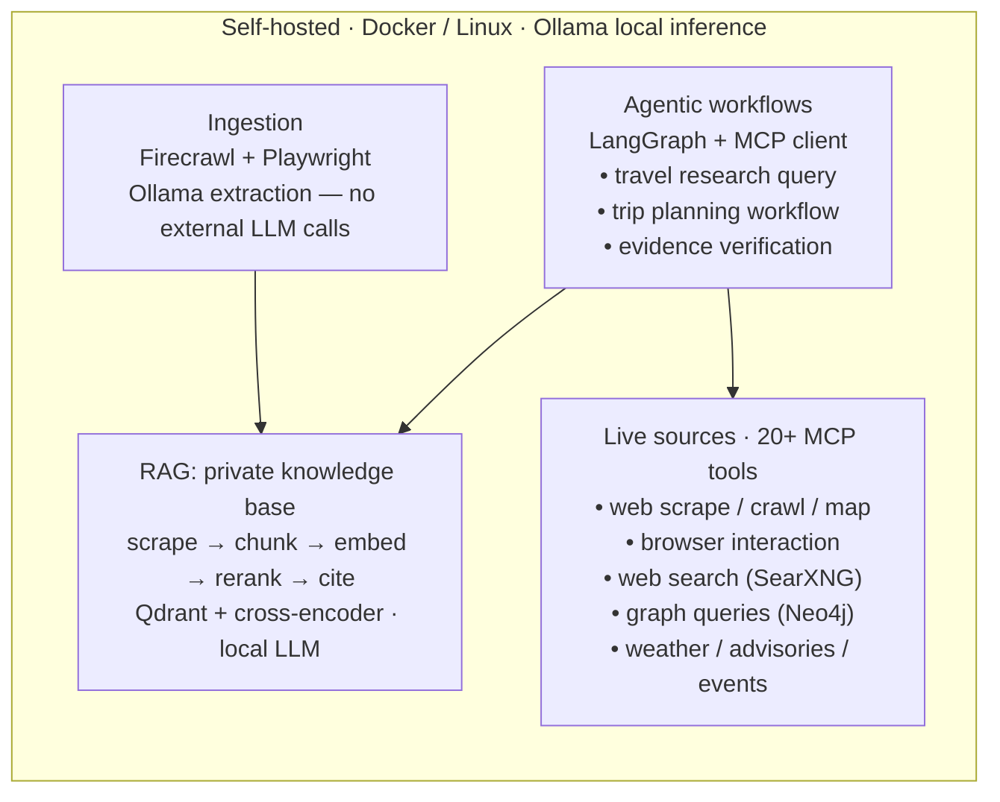

# voyages-by-dave

Architecture overview of the self-hosted agentic AI platform behind [Voyages By Dave](https://voyagesbydave.ca) — a Canadian travel-planning service where AI does the research and a human makes the judgment calls.

> This repo is the map, not the territory. It documents the platform's architecture, design principles, and components. The deployable code lives in the component repos linked below.

## What it does

Planning travel across Canada means pulling from dozens of sources: airlines, rail operators, ferries, cruise lines, hotels, tourism organizations, parks, attractions, and accessibility information. The platform fuses those into single research queries — for example, combining **weather, travel advisories, events, and vendor knowledge** into one travel-research request.

It exists to counter the three weaknesses of consumer AI: **missing context, model hallucination, and stale training data**. Instead of relying on what a model remembers, agentic workflows search and cross-check live sources, and every answer carries its citations.

The operating rule, from the business it serves:

> *Technology helps with the research. Evidence helps establish the facts. Experience and judgment turn those facts into a trip.*

## Impact

Reusable agentic workflows for research and trip planning cut complex research tasks from **2–3 hours to under 10 minutes** — a reduction of over 90%.

## Design principles

- **Local-first inference.** LLMs run on private infrastructure (Ollama). Sensitive data never leaves the building and never lands in third-party logs.
- **Grounded, not remembered.** Agents pull live data through 20+ MCP tools connected to curated sources. Nothing is answered from training memory alone.
- **Required citations.** Answers are traceable to their sources — source validation is built into the workflow, not bolted on after.
- **Least privilege.** Each workflow gets limited tool access: only the tools its job needs.
- **Verify, then trust.** Schedules, ferry reservations, road status, and accessibility claims are cross-checked against current sources. Stale data is treated as a defect.

## Architecture

## Components

| Component | Repo | Role |
|---|---|---|
| RAG engine | [drintoul/rag](https://github.com/drintoul/rag) | Self-hosted semantic search: scrapes, chunks, embeds, and reranks content (Qdrant + cross-encoder) so queries over a private knowledge base return answers with verified source citations. FastAPI + Ollama + Firecrawl. [Live demo](https://rag.davidrintoul.info) |
| Evidence checker | [drintoul/is-it-canadian](https://github.com/drintoul/is-it-canadian) | The verification pattern in miniature: an agentic workflow finds the official site, scrapes corporate pages, and a local model classifies from collected evidence — hours of manual checking in minutes, with a citation trail per verdict. [Live demo](https://canadian.davidrintoul.info) |
| Scraping & browser automation | [drintoul/firecrawl-extended](https://github.com/drintoul/firecrawl-extended) | Self-hosted Firecrawl behind one REST gateway: upstream scrape/crawl/map/search endpoints, a web console, custom Playwright browser sessions (`/v1/interact` — clicking, form-filling, screenshots), Ollama-backed extraction (`/v1/extract`), and an MCP interface so agents get the same surface as tools |
| Knowledge graph | [drintoul/neo4j](https://github.com/drintoul/neo4j) | Production-hardened Neo4j stack (localhost-only, non-root, read-only containers) with a React/Cytoscape UI, natural-language-to-Cypher via a local LLM, and an MCP server (`run_cypher`, `generate_cypher`, `get_neighbors`, `get_shortest_path`) for AI-driven graph queries |

## How the business uses it

Voyages By Dave's planning process — **Understand → Research → Verify → Design → Book and support** — is where the platform slots in. The Research and Verify stages are the expensive ones: dozens of sources, changing schedules, accessibility details that "accessible" labels don't capture. The platform does the hunting across live sources with citations; the advisor does the judging.

It also powers the public evidence of the approach: the [RAG live demo](https://rag.davidrintoul.info) and the [Is It Canadian? checker](https://canadian.davidrintoul.info).

## Tech stack

Python · FastAPI · LangGraph · MCP · Ollama (local LLMs) · Qdrant · Neo4j · Firecrawl · Playwright · SearXNG · Docker · Linux

## Links

- **Business:** [voyagesbydave.ca](https://voyagesbydave.ca)
- **Author:** [davidrintoul.info](https://davidrintoul.info) · [GitHub](https://github.com/drintoul) · [LinkedIn](https://www.linkedin.com/in/david-rintoul)

## About

Built and operated by **David R. Rintoul, CISSP** — AI Solutions Architect based in Abbotsford, BC. Twenty-plus years across enterprise architecture, cybersecurity, data governance, and product development; a decade as an Operations & Safety Director with a zero-incident record across thousands of commercial dives — now applied to AI systems where the discipline is the same: manage operational risk by design, not after the fact.
